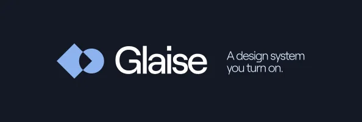
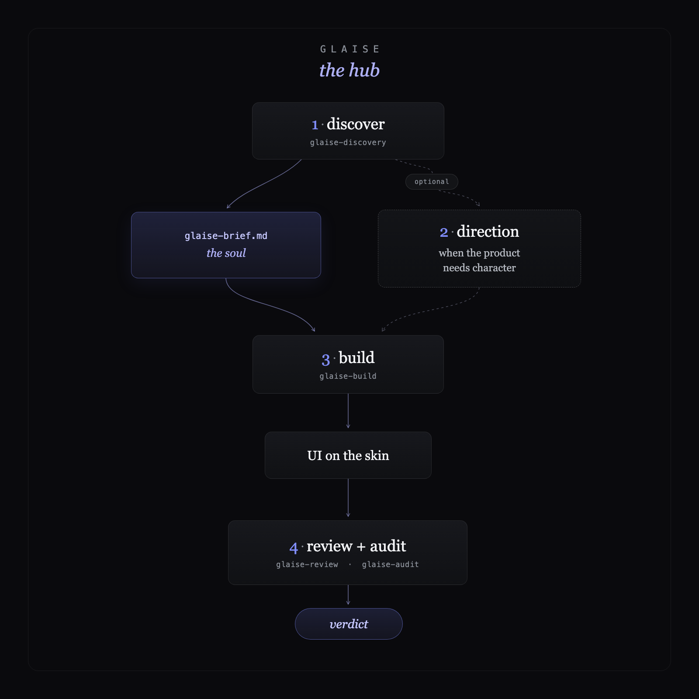
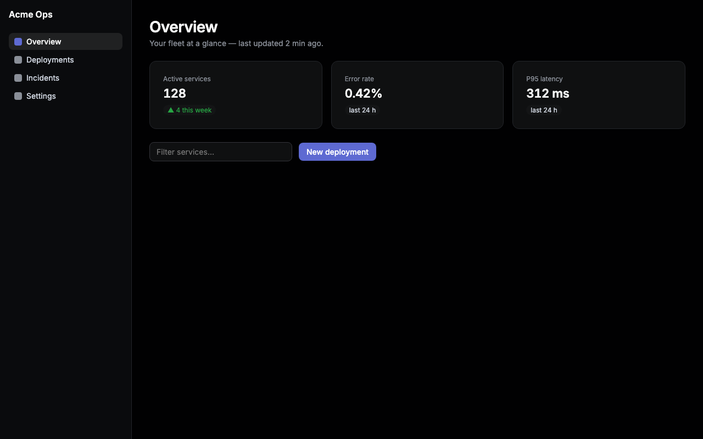
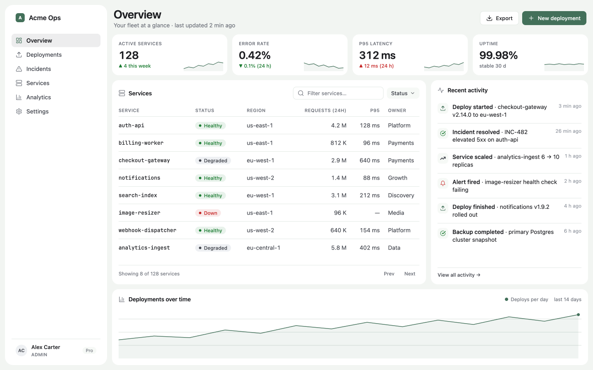
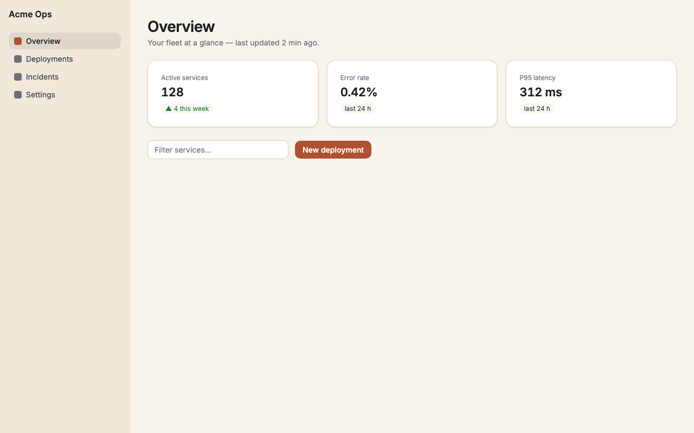
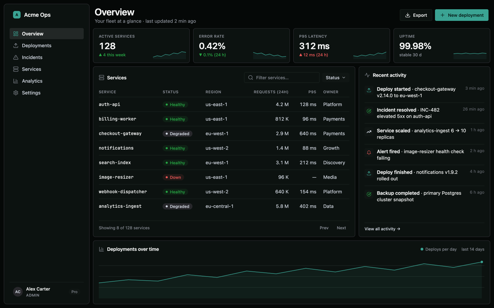
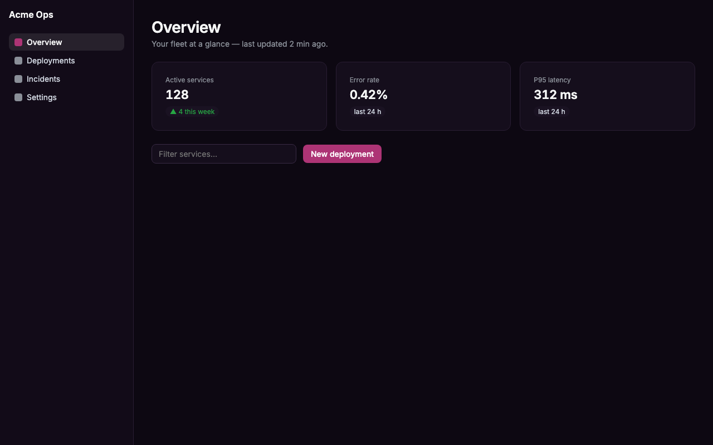
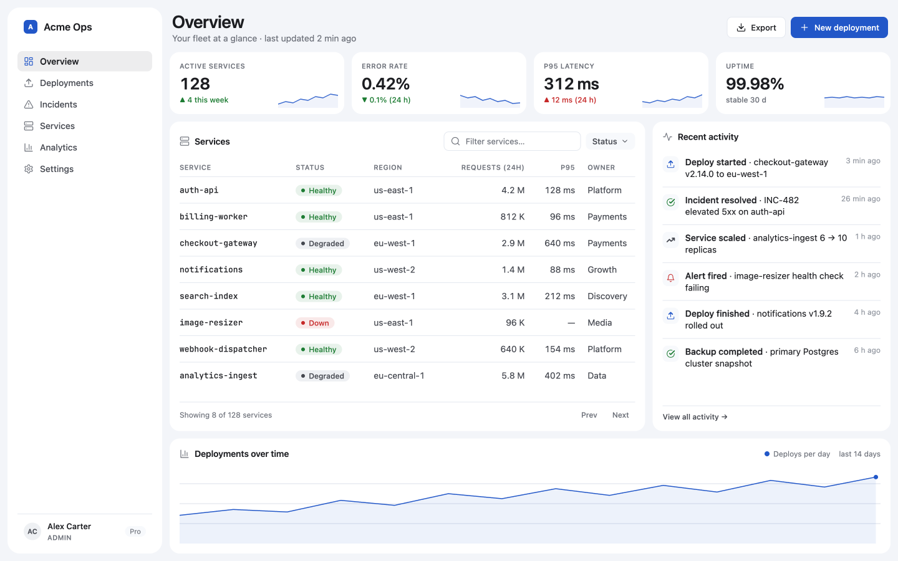

[](#install)


**Glaise is a design system you turn on — for admin panels, dashboards, and internal tools.** The interfaces you build instantly belong to one visual family — recognizable at a glance — while every product keeps its own layout and personality.

> **The skin is Glaise; the soul is the product's.**

**Scope, stated plainly:** Glaise builds **product UI** — administrative panels, dashboards, consoles, back-offices, internal tools. It is **not** for marketing websites, landing pages, blogs, or brochures; those want a brand voice per project, which is the opposite of a fixed shared skin.

- **One family, many products** — every UI is unmistakably the same system, yet never a clone.
- **Product-grade craft, built in** — real hierarchy, motion, complete states, accessible primitives. No "AI-generated" look.
- **Fixed skin, free soul** — color, type, depth, and icons are locked; layout, domain, and each product's *signature* are yours.

Glaise ships as a set of plain `SKILL.md` skills — **portable across Claude Code, OpenCode, Codex, Cursor, and claude.ai** — and, for Claude Code, as an optional **plugin** that adds native updates and a soft review nudge on top of the same skills.

---

## Install

Same design system — pick how you deliver it.

### As a Claude Code plugin — recommended

```
/plugin marketplace add maclevison/glaise
```

```
/plugin install glaise@glaise
```

You get the same skills **plus** native `/plugin` updates and a **soft review nudge**: when you change UI in a Glaise project and finish a turn, the plugin reminds the agent to run `glaise-review` before wrapping up — once per session, never a hard gate.

### As portable skills — Claude Code · OpenCode · Codex · Cursor · claude.ai

One command, no clone needed (installs to `~/.claude/skills/`, which Claude Code, OpenCode — and Cursor, via its `.claude/skills` compatibility — all read):

```bash
curl -fsSL https://raw.githubusercontent.com/maclevison/glaise/main/install.sh | bash
```

**Codex · Cursor** — same command, shared Agent Skills folder (`~/.agents/skills/`, which both read; Codex does *not* read `~/.claude/skills`):

```bash
curl -fsSL https://raw.githubusercontent.com/maclevison/glaise/main/install.sh | bash -s -- --target agents
```

Then ask your agent to **use the `glaise` skill** — or invoke it directly: `$glaise` in Codex, `/glaise` in Cursor. The delivery methods coexist — the plugin is a thin wrapper over these same skills, not a dependency. The review nudge ships only with the Claude Code plugin; for Codex/Cursor, optionally add a line to the project's `AGENTS.md`: *"after changing UI, run the glaise-review skill before finishing."*

<details>
<summary><b>More install options</b> — per-project, OpenCode's native folder, from a clone, manual, updates</summary>

**Per-project** — into a target repo's `.claude/skills/`:

```bash
curl -fsSL https://raw.githubusercontent.com/maclevison/glaise/main/install.sh | bash -s -- --project ./my-app
```

**Pick the destination layout** with `--target` (the skills are identical, only the folder differs):

| `--target` | Global | Per-project |
|---|---|---|
| `claude` *(default)* | `~/.claude/skills/` | `./.claude/skills/` |
| `opencode` | `~/.config/opencode/skills/` | `./.opencode/skills/` |
| `agents` | `~/.agents/skills/` | `./.agents/skills/` |

OpenCode reads **all** of these; Cursor reads `claude` and `agents` (plus its own `.cursor/skills`, not `opencode`); Codex reads only `agents`. So `claude` (the default) already covers Claude Code, OpenCode, and Cursor — pick `agents` when Codex is in the mix, and `opencode` only when an OpenCode-only project should stay free of a `.claude/` folder.

**From a clone** (for contributors, or to track updates with a symlink):

```bash
git clone https://github.com/maclevison/glaise.git
cd glaise
./install.sh                    # global, into ~/.claude/skills/
./install.sh --project .        # into ./.claude/skills/
./install.sh --link             # symlink instead of copy — pull to update
```

**Manual** — copy the `glaise*` folders from `skills/` into the target repo's `.claude/skills/` (or `~/.claude/skills/` for a global install).

**Updates** — plugin users update with `/plugin`. Skill users run `install.sh --check` (or ask the agent to use the `glaise-update` skill), which compares the installed version against the latest release and prints the update command.

</details>

---

## How it works



1. **Discover** — a short interview captures the product's *soul* into a `glaise-brief.md`.
2. **Direction** *(optional)* — amplify character within the fixed skin.
3. **Build** — assemble the UI on top of the skin, guided by the brief.
4. **Review & audit** — taste (`glaise-review`) plus evidence (`glaise-audit`). Ship when both clear.

The agent runs this under the **`glaise` hub** — ask it to *use the glaise skill* and it invokes the right satellites in order.

---

## The skills

| Skill | Role | When to use |
|---|---|---|
| **`glaise`** | Hub / orchestrator | Entry point for building any product UI |
| **`glaise-discovery`** | Interview the soul | Start of a new project, before any code |
| **`glaise-brand`** | Brand the skin per client | Once per company — or pick a curated pigment |
| **`glaise-build`** | Construction | Build or extend the UI from the brief |
| **`glaise-direction`** | Extra character | When the product needs stronger visual personality |
| **`glaise-review`** | Taste pass | Judge craft, family, and soul before merge |
| **`glaise-audit`** | Evidence pass | Verify the measurable quality before merge |
| **`glaise-update`** | Stay current | Update the installed skills to the latest release |
| **`glaise-design-sync`** | Publish to Claude Design | Push the effective skin to claude.ai/design as preview cards |

<details>
<summary><b>What each skill does</b></summary>

- **`glaise` — the hub.** Loads the family (`design.md`, `tokens.css`, `theme.css`, `motion.md`) and runs the `discover → build → review & audit` flow (+ direction on demand). It orchestrates; it doesn't duplicate.
- **`glaise-discovery` — the soul.** A short interview capturing the real user, task, domain, *feel*, **signature**, and stack, persisted to `glaise-brief.md` in the project's `docs/glaise/`. The main antidote to convergence. Offers `git init` on a new project.
- **`glaise-brand` — the per-client skin.** Run once per client to capture their identity (accent, neutrals, type, radii, density, elevation) into a `brand.css` that overrides only the `--glaise-*` tokens they change — or copy a curated pigment pack as its `brand.css`. A client that never runs it keeps the default skin; the engine stays invariant. AA is enforced over the effective tokens by `glaise-audit`.
- **`glaise-build` — the construction.** Builds from the brief with real craft: hierarchy (weight + color + ink ramp), the surface ladder, motion < 300ms, complete states. Uses headless primitives (Base UI / Reka UI) and Lucide icons, applies the theme, and inherits the client's `brand.css` if present.
- **`glaise-direction` — the character.** On demand, decides *where to spend boldness within the fixed skin* — signature, layout, motion, density, expressive Inter — in one place. Never repaints the skin.
- **`glaise-review` — the taste pass.** A strict review against three bars: **craft** (would a design lead sign it?), **family** (unmistakably Glaise?), **soul** (does it carry the brief's signature?). Judges by default; rebuilds only when asked.
- **`glaise-audit` — the evidence pass.** The measurable sibling of review: WCAG contrast on both themes, token fidelity (no hardcoded hex/px, no undefined vars), responsive/touch targets, complete states, family-mechanical conformance. Run both before merge.
- **`glaise-update` — stay current.** Updates the installed skills to the latest release (detects the install, compares versions, runs the installer).
- **`glaise-design-sync` — the bridge to Claude Design.** Generates `docs/glaise/design-bundle/` — self-contained `@dsCard` preview HTMLs of the *effective* skin (default tokens + the client's `brand.css`) — and uploads it to a claude.ai/design design-system project (one per brand). Designs made there then start from the Glaise family.

</details>

---

## Concept — skin vs soul

**Non-negotiable (the skin — identical across every project):** palette and color · **Inter** type · monochrome primary (washed ink — chroma only via pigment/brand) · the *surface ladder* (canvas → surface-1..4) and hairlines · floating panels · radius and spacing scales · **Lucide** icons · **headless primitives** (Base UI / Reka UI) — never a styled UI kit.

**Free (the soul — decided per product):** layout, composition, hierarchy, and focus · density within range · which screens exist · content and voice · the **signature** — the one element that could only exist in *this* product.

> Rule of thumb: if the change alters *what the brand looks like*, it's skin (fixed). If it alters *what this product does*, it's soul (free).

## Pigments — the engine is the clay; the pigment is yours

The default skin is the family's face — but it's one of six. A **pigment** is a curated,
pre-made skin: same engine, same AA guarantees (test-enforced on both themes), different
character — mineral colors applied to the clay. Pick one at discovery, or bring a client identity with
[`glaise-brand`](#the-skills) (**default** · **pigment** · **custom** — one question,
three doors).

| | Skin | Theme | Character | For |
|---|---|---|---|---|
|  | **Glaise** *(default)* | Light | Quietly luxurious — monochrome washed ink, the family's face | Everything |
|  | **Celadon** | Light | Editorial, calm like a reading room — celadon glaze | Docs, content |
|  | **Terracotta** | Light | Warm like fired clay — burnt orange on cream, rounder corners | Notes, personal tools |
|  | **Verdigris** | Dark | Dense like a trading floor — copper patina, minimal radii | Devtools, observability |
|  | **Tyrian** | Dark | Expressive and luxurious — imperial purple | Creative, social |
|  | **Cobalt** | Light | Sober corporate blue | Enterprise SaaS, B2B |

Vocabulary: **default** = the clay before any pigment — the family's face · **pigment** =
a curated pre-made skin · **brand** = a client's bespoke skin. All three are the same mechanism — effective
`--glaise-*` tokens; the engine (ladder model, type ratios, spacing, motion, AA) never
changes.

---

<details>
<summary><b>The skin — internals, themes, and per-client brand</b></summary>

### The skin

The skin lives in `skills/glaise/references/`:

- **`design.md`** — the semantic source (the "why" behind each decision).
- **`tokens.css`** — the canonical technical source: CSS custom properties (`--glaise-*`).
- **`theme.css`** — the **Tailwind v4** preset (`@theme`) that *references* `tokens.css` (never redeclaring values).
- **`motion.md`** — the family's motion layer (curves, durations, decision-before-how).
- **`shells.md`** — app-shell archetypes (Console / Focused / Workbench / Reader / Canvas).
- **`contrast.mjs`** — the WCAG contrast checker over the tokens, plus the semantic-separation rule contrast math is blind to: two colors can both clear AA on the same surface and still be the same color to the user, so `--glaise-danger` must stay ≥30° in hue from `--glaise-primary` — otherwise an error reads as a CTA. Used by `glaise-audit`.

The `design.md → tokens.css → theme.css` chain makes Tailwind **inherit the skin at runtime**: change one value in `tokens.css` and it propagates everywhere, no rebuild.

### Themes (dark / light)

Light is the default and the family's face. Dark is the **same skin inverted** (`:root[data-theme="dark"]`): same Inter, same monochrome primary (value flipped to a washed white for AA), inverted surface ladder. Cards are **edge-free on both themes** by default — separation by value alone; a dark hairline ring is a per-project taste choice asked at discovery. Choose the theme per project: **light / dark / both**. "Both" generates a toggle (Lucide sun/moon) with persistence and an anti-FOUC script.

### Brand (per client)

A client's identity lives in a per-client **`brand.css`** from [`glaise-brand`](#the-skills), loaded **last** (`tokens.css` → `theme.css` → `brand.css`) so it wins by cascade with no rebuild; everything it omits falls through to the default skin — a curated pigment is mechanically the same thing, a pre-made `brand.css`. AA over the effective tokens is checked by `glaise-audit` (`contrast.mjs --brand`), which suggests a hue-preserving fix for any failing pair.

</details>

<details>
<summary><b>Default stack</b></summary>

| Layer | Choice | Note |
|---|---|---|
| Type | **Inter** (+ JetBrains Mono) | Fixed part of the skin |
| CSS | **Tailwind v4** (`theme.css` preset) | Recommended, not required — without Tailwind, import `tokens.css` |
| Primitives | **Base UI** (React) · **Reka UI** (Vue) | Headless; never a styled UI kit (Material/Vuetify/Chakra/Ant) |
| Icons | **Lucide** | `lucide-react` / `lucide-vue-next` — same icons in both frameworks |

</details>

<details>
<summary><b>Repository layout</b></summary>

```
.claude-plugin/
├── plugin.json          plugin manifest (wires the Stop hook)
└── marketplace.json     marketplace entry (root-as-plugin, source "./")
hooks/
├── hooks.json           Stop hook (asyncRewake)
└── nudge-review.sh      the review nudge (pure bash + git)
skills/
├── glaise/              hub
│   ├── SKILL.md
│   └── references/      design.md · tokens.css · theme.css · motion.md · shells.md · contrast.mjs
├── glaise-discovery/
├── glaise-brand/
│   └── references/pigments/  the 5 curated pigment packs
├── glaise-build/
├── glaise-direction/
├── glaise-review/
├── glaise-audit/
├── glaise-update/
└── glaise-design-sync/
    └── references/build-design-bundle.mjs   @dsCard preview generator (Claude Design)
install.sh               installer (skills → Claude Code / OpenCode / Codex / Cursor / claude.ai)
scripts/                 zero-dep tests + the skills validator
```

The skills are versioned at `skills/` in the repo root. The plugin (root-as-plugin) auto-discovers them; `install.sh` copies or symlinks them into each agent's skills directory — so the repo itself carries no `.claude/` folder.

</details>

---

## Contributing

Run the validator after editing skills or tokens (zero dependencies):

```bash
node scripts/validate-skills.mjs
node scripts/test-pigments.mjs
```

It checks skill portability (kebab-case names, OpenCode-compatible), the `theme.css → tokens.css` token chain, the brief template, the build/review/direction references, and the dark-theme block. `test-pigments.mjs` holds each of the 5 curated pigment packs to the same bar as the default skin: AA contrast **and** semantic separation.

Audit the skin directly:

```bash
node skills/glaise/references/contrast.mjs                  # pairs + separation, both themes
node skills/glaise/references/contrast.mjs '#6c7079' '#ffffff'   # ad-hoc pair (quote hex — # is special in the shell)
```

```text
  #6c7079 on #ffffff  →  4.96:1  [AA]
  AA normal (4.5): PASS   AA large (3.0): PASS
```

The plugin's manifests and Stop hook have their own zero-dep tests: `node scripts/test-plugin-manifests.mjs` and `node scripts/test-nudge-hook.mjs`.
